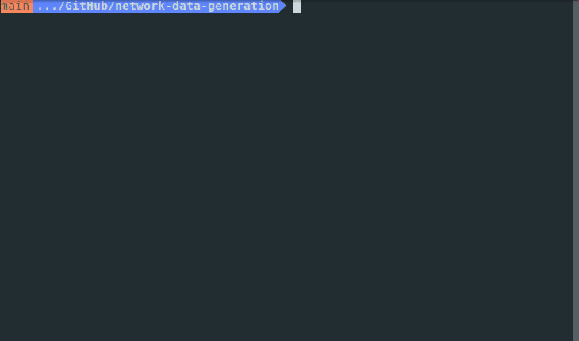

<h1 align="center"><b>DANE - Data Automation and Network Emulation Tool</b> </h1>
<hr>

# Why Use Dane?

DANE provides two core functionalities:

1. Automatically collect network traffic datasets in a parallelized manner

   Manual data collection for network traffic datasets is a long and tedious process—run the tool and you can easily collect multiple hours of data in one hour of time (magic!) with one or many desired 'user' behaviors.

2. Emulate a diverse range of network conditions that are representative of the real world

   Data representation is an increasingly relevant issue in all fields of data science, but generating a dataset while connected to a fixed network doesn't capture diversity in network conditions—in a single file, you can configure DANE to emulate a variety of network conditions, including latency and bandwidth.

You can easily hack the tool to run custom scripts, custom data collection tools, and other custom software dependencies which support your particular research interest.

# Tool

Our tool establishes Docker containers with configurable network conditions,
then runs target behaviors such as browsing the internet, and collects data on
the network traffic generated using
[network-stats](https://github.com/parkeraddison/network-stats/tree/5e4173d310faf40b7f35262e0a18e447ba91e5dc).

To use the tool, you must configure your desired network conditions and behaviors.

Source code for the tool can be found at [network-data-generation](https://github.com/dane-tool/dane).

### Requirements

The data collcetion tool runs on Linux. You will need:

- [Docker 19.03+](https://docs.docker.com/get-docker/)
- [Docker Compose 1.27+](https://docs.docker.com/compose/install/)
- [GNU Make](https://www.gnu.org/software/make/)

### Getting Started

You can start using this tool and conducting analysis of different network conditions by running:

```bash
git clone \
https://github.com/dane-tool/dane.git \
--recursive
```

### Configuration

See [`tool.json`](https://github.com/parkeraddison/generating-and-analyzing-network-traffic-in-diverse-network-conditions/blob/main/config/tool.json) for configuration:

| Key        | Description                                                                                                                                                                             |
| ---------- | --------------------------------------------------------------------------------------------------------------------------------------------------------------------------------------- |
| behaviors  | List of one or more target behaviors. All target behaviors will be run for each specified set of network conditions. For possible values see [Target behaviors](#target-behaviors).     |
| conditions | List of nested configuration specifying desired network conditions. E.g. `[{"latency": "50ms", "bandwidth": "10Mbps"}]`. For configuration see [Conditions config](#conditions-config). |
| vpn        | Nested configuration for a VPN connection. For configuration see [VPN Config](#vpn-config).                                                                                             |

<a name="target-behaviors"></a>
**Target behaviors**

| Value     | Description                                                               |
| --------- | ------------------------------------------------------------------------- |
| ping      | Ping a DNS server once every three seconds.                               |
| script    | Run a script that replicates the `ping` behavior. **Will be deprecated**. |
| none      | Do nothing.                                                               |
| browsing  | Run a script to endlessly browse Twitter.                                 |
| streaming | Run a script to endlessly watch YouTube.                                  |

<a name="conditions-config"></a>
**Conditions config**

| Key       | Description                                                                       |
| --------- | --------------------------------------------------------------------------------- |
| latency   | Milliseconds. The desired amount of network latency to be injected. E.g. `"50ms"` |
| bandwidth | Megabits per second. The desired download speed. E.g. `"10Mbps"`                  |

<a name="vpn-config"></a>
**VPN config**

| Key     | Description                                                          |
| ------- | -------------------------------------------------------------------- |
| enabled | `true` or `false`. Whether or not a VPN should be used. **WIP**      |
| server  | URL or IP to the desired VPN service. E.g. `"vpn.ucsd.edu"`. **WIP** |

### Environment file and secrets

The containers will need secret variables that store things like VPN or website login credentials.

Please create a file named `.env` and place it in this directory. Inside the file, add the login information for your VPN:

```
VPN_USERNAME=<your username>
VPN_USERGROUP=<the 'group' to use for the VPN -- probably "2-Step Secured - allthruucsd">
VPN_PASSWORD=<your password>
```

### Running

Once you're satisfied with your configuration, simply open a terminal to this directory, and run

```bash
make
```

When you're done collecting data, open a new terminal in this directory and run

```bash
make stop
```

### Example



### Data

After the tool has been stopped, data can be found in `data/`.

### FAQ

1. **The tool isn't working. It fails silently, or fails to launch behaviors or network-stats.**
   Make sure that all submodules have been cloned. You can do this by running
   ```bash
   git submodule update --init --recursive
   ```

### Citing

If you choose to use this tool, please cite it with the following BibTeX entry: **WIP**

```bibtex
@misc{tbd2021,
  author = {Addison, Parker and
            Altekar, Sahil and
            Yaseen, Danial},
  title  = {DANE - Data Automation and Network Emulation Tool},
  school = {University of California, San Diego},
  year   = 2021,
  url    = {https://github.com/dane-tool/dane}
}
```

# Proof of Concept

(TODO - Link to Analysis Report)

# Contributing

See something you'd like improved? Better yet, have some improvements coded up locally you'd like to contribute?

We welcome you to **submit an Issue** or **make a Pull Request** detailing your ideas!

# Acknowledgements

This project was originally created in affiliation with the **Halıcıoğlu Data Science Institute**'s data science program at UC San Diego.  
https://hdsi.ucsd.edu/, https://dsc-capstone.github.io/

DANE was motivated and developed with the generous support of **Viasat**.  
https://viasat.com/
